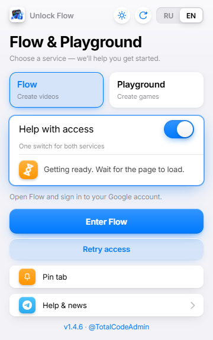
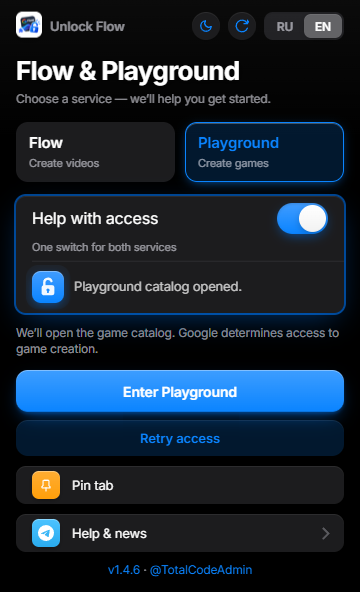

# Unlock Flow

Unlock Flow is a Chrome and Firefox extension that helps you access Google Flow and the Playground game catalog when regional restrictions block entry. It automatically applies the entry method for the selected service: Flow for creating videos or Playground for browsing games.

The popup lets you choose a service, enable access help, open or pin a tab, and check for updates. On your first Playground visit, the extension waits for you to complete Google's game profile setup, then continues to the catalog.

Playground catalog access has been verified. Game creation and account limits depend on Google and have not been tested separately.

[Download the extension and updates](https://github.com/Kam300/Unlock-Flow/releases) · [Author's Telegram channel](https://t.me/TotalC0de) · [Русский](README.md)

## Screenshots

Flow in the light theme and Playground in the dark theme. Status messages are shown as examples.

| Flow · light theme | Playground · dark theme |
|:---:|:---:|
|  |  |

## Choose your download

- Chrome: `Unlock-Flow-v<version>.zip`.
- Firefox: `Unlock-Flow-Firefox-v<version>.zip` (Firefox 142 or newer).
- Use the extension ZIP for your browser. GitHub's Source code archives contain the project source files.

## Chrome installation and updates

Extract the Chrome ZIP into a permanent folder. Open `chrome://extensions`,
turn on Developer mode, click Load unpacked, and select the folder containing
`manifest.json`. Keep that folder in place.
To update, click ↻ or the version number in the popup, then Download Update.
Extract the new ZIP into the SAME folder, replacing files. Reopen the popup,
click Files replaced — restart, and refresh the service tab.
Do not remove the extension or load a second copy. Older versions without
this restart button can be reloaded using ↻ on their `chrome://extensions` card.

## Firefox installation and updates

Open `about:debugging#/runtime/this-firefox`, click Load Temporary Add-on,
and select the Firefox ZIP without extracting it.
The unsigned add-on is removed when Firefox fully closes. Permanent installation
requires a Firefox-signed build.
Starting with version 1.4.6, the popup's ↻ button and version number check
for updates and download the Firefox ZIP. Load the new ZIP through
about:debugging. If replacement fails, remove the previous temporary add-on
on that page and load the new ZIP again. Version 1.4.5 requires a manual
download from the releases page. The Chrome restart button is not used.

## Using the extension

Choose Flow or Playground and click the main button. Enable and open performs
both steps in one click. The switch controls both services; existing tabs are reused.
On first use of Playground, complete Google's game profile setup yourself.
The helper waits for the dialog to close, then continues to the catalog.
Playground catalog access has been verified; game creation and account limits
have not been tested separately and remain subject to Google's availability.
