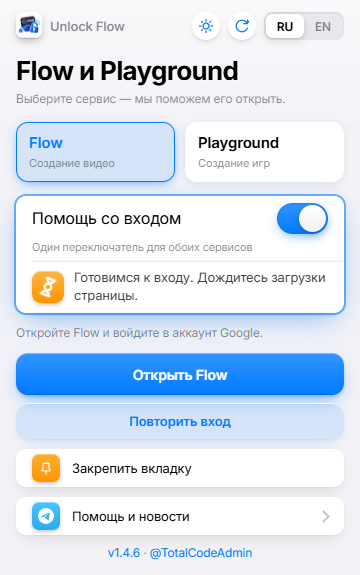
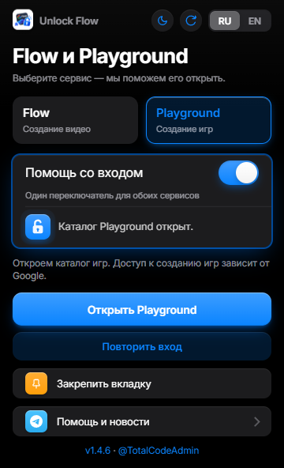

# Unlock Flow

Unlock Flow — расширение для Chrome и Firefox, которое помогает открыть Google Flow и каталог Playground при региональных ограничениях. Оно автоматически применяет способ входа для выбранного сервиса: Flow для создания видео или Playground для просмотра игр.

В одном окне можно выбрать сервис, включить помощь со входом, открыть или закрепить вкладку и проверить обновления. При первом входе в Playground расширение ждёт, пока вы завершите настройку игрового профиля Google, затем продолжает переход в каталог.

Для Playground проверен вход в каталог; доступ к созданию игр и лимиты аккаунта зависят от Google и отдельно не проверялись.

[Скачать расширение и обновления](https://github.com/Kam300/Unlock-Flow/releases) · [Канал автора в Telegram](https://t.me/TotalC0de) · [English](README.en.md)

## Скриншоты

Flow в светлой теме и Playground в тёмной. Статусы на скриншотах показаны для примера.

| Flow · светлая тема | Playground · тёмная тема |
|:---:|:---:|
|  |  |

## Какой файл скачать

- Chrome: `Unlock-Flow-v<версия>.zip`, например `Unlock-Flow-v1.4.6.zip`.
- Firefox: `Unlock-Flow-Firefox-v<версия>.zip`.
- Архивы Source code на странице релиза — исходники проекта. Для установки
   выбирайте готовый ZIP расширения с названием Unlock-Flow.

## Установка в Chrome

1. Скачайте ZIP для Chrome и распакуйте его в отдельную постоянную папку.
2. Откройте `chrome://extensions` и включите «Режим разработчика».
3. Нажмите «Загрузить распакованное расширение» и выберите папку,
   в которой находится `manifest.json`.
4. Не удаляйте и не перемещайте эту папку после установки.

## Обновление в Chrome

1. В окне расширения нажмите ↻ или номер версии, затем «Скачать обновление».
2. Распакуйте ZIP в ПРЕЖНЮЮ папку расширения с заменой файлов.
3. Снова откройте расширение и нажмите «Файлы заменены — перезапустить».
4. Обновите вкладку Flow или Playground.

Не удаляйте расширение и не загружайте вторую копию.
Если кнопки перезапуска в старой версии нет, нажмите ↻ на карточке расширения
на странице `chrome://extensions` после замены файлов.

## Установка в Firefox (142 или новее)

1. Скачайте ZIP с Firefox в названии. Распаковывать его не нужно.
2. Откройте `about:debugging#/runtime/this-firefox`.
3. Нажмите «Загрузить временное дополнение…» и выберите скачанный ZIP.

Сборка пока не подписана Mozilla. После полного закрытия Firefox временное
дополнение удалится, и его нужно будет загрузить снова.
Для постоянной установки требуется сборка с подписью Firefox.

## Обновление в Firefox

1. Нажмите ↻ или номер версии в окне расширения, затем «Скачать обновление».
   Проверка обновлений доступна начиная с версии 1.4.6 и скачивает Firefox ZIP.
2. На странице `about:debugging#/runtime/this-firefox` нажмите
   «Загрузить временное дополнение…» и выберите новый ZIP.
3. Если Firefox не позволяет заменить дополнение, удалите прежнюю временную
   копию на этой странице, затем загрузите новый ZIP.

В версии 1.4.5 скачайте новый Firefox ZIP со страницы релизов вручную.
Кнопка «Файлы заменены — перезапустить» предназначена для Chrome.

## Как пользоваться

Выберите Flow или Playground и нажмите основную кнопку открытия.
«Включить и открыть» включает помощь и открывает сервис одним нажатием.
Переключатель общий для обоих сервисов. Уже открытые вкладки используются повторно.
При первом входе в Playground завершите настройку игрового профиля Google.
Расширение дождётся закрытия этого окна и продолжит переход в каталог.
Для Playground проверен вход в каталог. Создание игр и лимиты аккаунта
отдельно не проверялись; доступ к ним зависит от Google.
